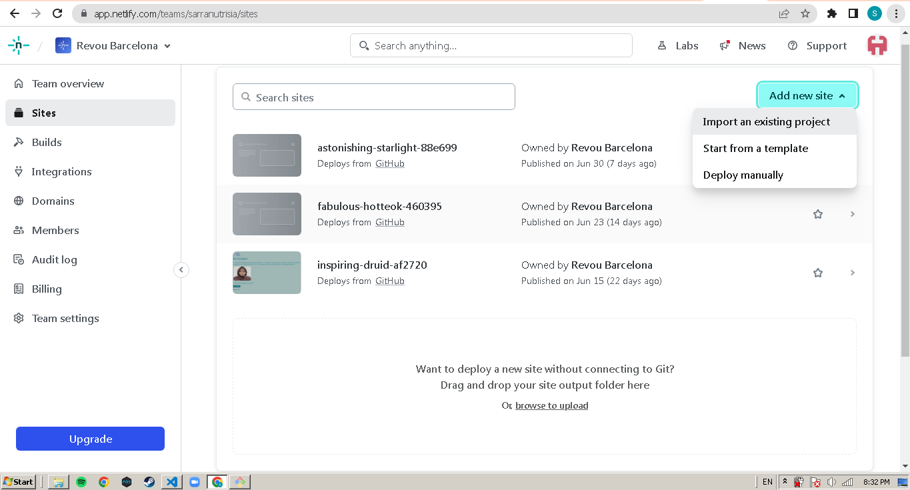

# Documentation
*Theme Name :* KATEDA Membership Club (Deployment & Custom Domain)

*Author :* Sarra Nutrisia

*Created :* 07/07/2023 

*HTML Version :* HTML 5

*CSS Version :* CSS 3

***
If you have any questions about this theme, feel free to e-mail me at **sarra.nutrisia@gmail.com**
***
## Table of Contents
1. HTML Structure
2. CSS File
3. JavaScript File
4. Readme File
5. Images File

***
## 1. HTML Structure
The HTML Structure for each page is as follows:
* Meta
* Link to CSS Files
* Link to JavaScript File
* Header
	* Home Link
	* About Link
	* Contact Link
* Content
	* Activities
	* Facts
	* Technic
	* Video
	* Form
* Footer
	* Copyright
  
Layout: https://astonishing-starlight-88e699.netlify.app/
  
***
## 2. CSS File
There are two CSS file in this theme:
* stle.css
* responsive.css

##### indexstyle.css
This CSS file is the main stylesheet for the theme. It holds all the values for the different elements of theme and the default color scheme.

##### responsive.css
This CSS file contain responsive web design provides an optimal experience, easy reading and easy navigation with a minimum of resizing on different devices such as tablet and desktop.

***
## 3. JavaScript File
There is one JavaScript file in this theme:
* index.js

##### index.js
This theme use the alert function of JavaScript.

***
# Deployment Process
There are 3 steps in Deployment Process such as Sign Up to Netlify, Connect to Github and Auto Deployment.
***
## 1. Sign Up to Netlify
Before sign up to netlify, make sure you have a github account and had push your project to your Github Account. After that, follow this step :
1. Go to https://www.netlify.com
2. Sign Up to Netlify > Sign Up with GitHub
3. After the configuration with GithHub, then choose Add New Site > Import an Existing Project

#### Theme by Sarra Nutrisia
If you have any other questions that aren't covered in the documentation, feel free to e-mail <sarra.nutrisia@gmail.com>.